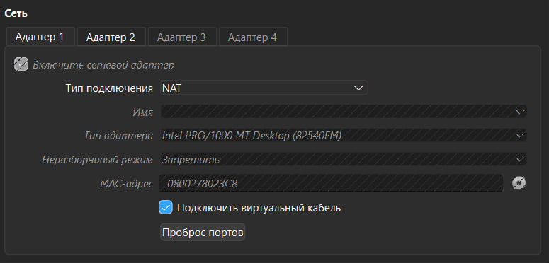
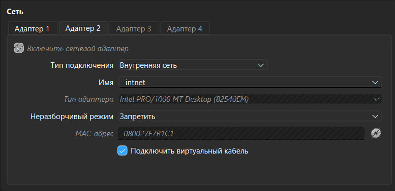
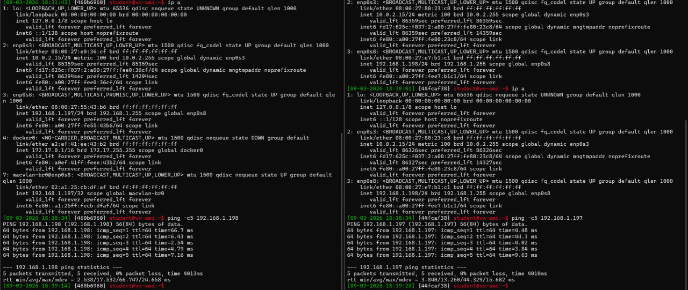
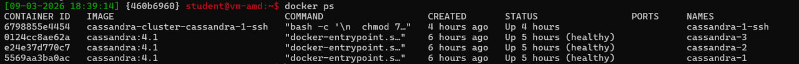
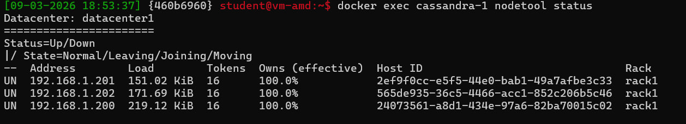
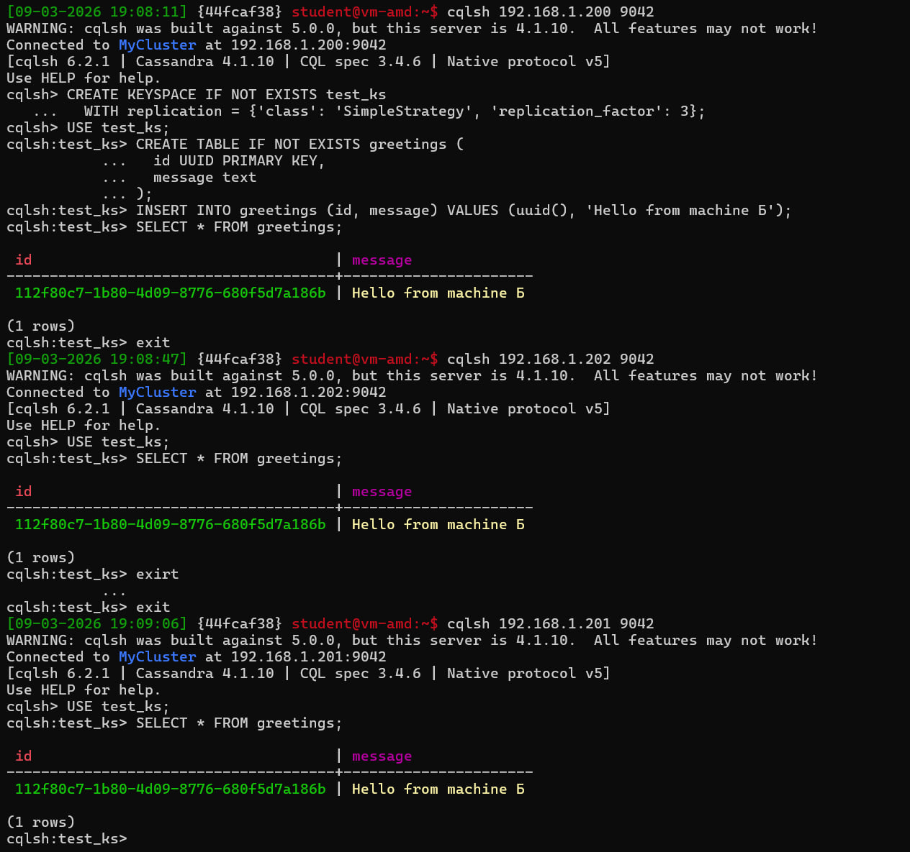
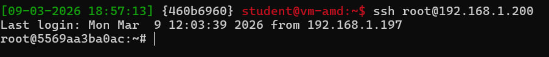

# Развёртывание кластера Cassandra с помощью Docker Compose

## Цель работы

Создать Docker Compose файл для развертки кластера из трех узлов Cassandra, которые должны быть доступен из локальной сети по отдельному IP адресу.

## Задания

1. На машине А в локальной сети с IP 192.168.1.197 запускается скрипт docker-compose для поднятия 3 образов с IP адресами 192.168.1.200-202.
2. Затем с машины Б из той же локальной сети с IP 192.168.1.198 необходимо подключиться через cqlsh к каждой из машин-образов.
3. Настроить SSH для возможности подключения к 1.200 с 1.197.

## Подготовка окружения

Виртуальные машины запускаем в VirtualBox и указываем два типа сетевых адаптеров: NAT для выхода в сеть и Internal Network для общения между ВМ.





### Настройка IP

На каждой ВМ создаём файл netplan для интерфейса enp0s8. На машине А:

```bash
sudo nano /etc/netplan/02-internal.yaml
```

```yaml
network:
  version: 2
  ethernets:
    enp0s8:
      dhcp4: no
      addresses:
        - 192.168.1.197/24
```

На машине Б — аналогично, но с адресом 192.168.1.198/24.

```bash
sudo netplan apply
```

Проверяем связность между машинами:

```bash
ping 192.168.1.198
ping 192.168.1.197
```



## Выполнение заданий

### Задание 1 — Кластер Cassandra с отдельными IP-адресами

Для выполнения первого задания по обеспечению каждого контейнера отдельным IP-адресом в общей локальной сети воспользуемся драйвером macvlan.
Macvlan создаёт для каждого контейнера свой виртуальный сетевой интерфейс со своим MAC-адресом, привязанный к физическому интерфейсу хоста.
В отличие от стандартной bridge-сети Docker (docker0), контейнеры в macvlan получают отдельные ip адреса и доступны в сети как хосты.

#### Установка Docker на машине А

```bash
sudo apt update
sudo apt install -y docker.io docker-compose-v2
sudo usermod -aG docker $USER
newgrp docker
```

#### Структура проекта

```bash
mkdir -p ~/cassandra-cluster/ssh
cd ~/cassandra-cluster
```

#### Docker Compose конфигурация

Файл `docker-compose.yml` описывает четыре сервиса: три ноды Cassandra и SSH-sidecar.

```yaml
services:
  cassandra-1:
    image: cassandra:4.1
    container_name: cassandra-1
    networks:
      lan:
        ipv4_address: 192.168.1.200
    environment:
      CASSANDRA_CLUSTER_NAME: "MyCluster"
      CASSANDRA_SEEDS: "192.168.1.200,192.168.1.201"
      CASSANDRA_LISTEN_ADDRESS: "192.168.1.200"
      CASSANDRA_BROADCAST_ADDRESS: "192.168.1.200"
      CASSANDRA_RPC_ADDRESS: "0.0.0.0"
      CASSANDRA_BROADCAST_RPC_ADDRESS: "192.168.1.200"
      MAX_HEAP_SIZE: "512M"
      HEAP_NEWSIZE: "128M"
    volumes:
      - cassandra-1-data:/var/lib/cassandra
    restart: unless-stopped
    healthcheck:
      test: ["CMD-SHELL", "nodetool status | grep -q '^UN'"]
      interval: 30s
      timeout: 30s
      retries: 10
      start_period: 600s

  cassandra-2:
    image: cassandra:4.1
    container_name: cassandra-2
    depends_on:
      cassandra-1:
        condition: service_healthy
    networks:
      lan:
        ipv4_address: 192.168.1.201
    environment:
      CASSANDRA_CLUSTER_NAME: "MyCluster"
      CASSANDRA_SEEDS: "192.168.1.200,192.168.1.201"
      CASSANDRA_LISTEN_ADDRESS: "192.168.1.201"
      CASSANDRA_BROADCAST_ADDRESS: "192.168.1.201"
      CASSANDRA_RPC_ADDRESS: "0.0.0.0"
      CASSANDRA_BROADCAST_RPC_ADDRESS: "192.168.1.201"
      MAX_HEAP_SIZE: "512M"
      HEAP_NEWSIZE: "128M"
    volumes:
      - cassandra-2-data:/var/lib/cassandra
    restart: unless-stopped
    healthcheck:
      test: ["CMD-SHELL", "nodetool status | grep -q '^UN'"]
      interval: 30s
      timeout: 30s
      retries: 10
      start_period: 600s

  cassandra-3:
    image: cassandra:4.1
    container_name: cassandra-3
    depends_on:
      cassandra-2:
        condition: service_healthy
    networks:
      lan:
        ipv4_address: 192.168.1.202
    environment:
      CASSANDRA_CLUSTER_NAME: "MyCluster"
      CASSANDRA_SEEDS: "192.168.1.200,192.168.1.201"
      CASSANDRA_LISTEN_ADDRESS: "192.168.1.202"
      CASSANDRA_BROADCAST_ADDRESS: "192.168.1.202"
      CASSANDRA_RPC_ADDRESS: "0.0.0.0"
      CASSANDRA_BROADCAST_RPC_ADDRESS: "192.168.1.202"
      MAX_HEAP_SIZE: "512M"
      HEAP_NEWSIZE: "128M"
    volumes:
      - cassandra-3-data:/var/lib/cassandra
    restart: unless-stopped
    healthcheck:
      test: ["CMD-SHELL", "nodetool status | grep -q '^UN'"]
      interval: 30s
      timeout: 30s
      retries: 10
      start_period: 600s

  cassandra-1-ssh:
    build:
      context: .
      dockerfile: Dockerfile.ssh
    container_name: cassandra-1-ssh
    network_mode: "service:cassandra-1"
    depends_on:
      cassandra-1:
        condition: service_healthy
    volumes:
      - ./ssh/authorized_keys:/root/.ssh/authorized_keys
      - ./ssh/sshd_config:/etc/ssh/sshd_config:ro
    entrypoint: >
      bash -c "
        chmod 700 /root/.ssh &&
        chown root:root /root/.ssh/authorized_keys &&
        chmod 600 /root/.ssh/authorized_keys &&
        exec /usr/sbin/sshd -D
      "
    restart: unless-stopped

networks:
  lan:
    driver: macvlan
    driver_opts:
      parent: enp0s8
    ipam:
      config:
        - subnet: 192.168.1.0/24
          gateway: 192.168.1.1
          ip_range: 192.168.1.200/30

volumes:
  cassandra-1-data:
  cassandra-2-data:
  cassandra-3-data:
```

Пояснения к ключевым параметрам compose-файла:

Все три ноды используют один образ `cassandra:4.1`, но каждая получает фиксированный IP в macvlan-сети.
`CASSANDRA_CLUSTER_NAME` одинаков у всех нод — это обязательное условие объединения в один кластер.
`CASSANDRA_SEEDS` указывает на .200 и .201 — это точки первого контакта для gossip-протокола.
Третья нода (.202) не является seed-нодой по рекомендации документации Cassandra.
`CASSANDRA_RPC_ADDRESS: "0.0.0.0"` позволяет принимать клиентские подключения (cqlsh) на всех интерфейсах, а `BROADCAST_RPC_ADDRESS` сообщает клиентам конкретный IP для подключения.
`MAX_HEAP_SIZE` и `HEAP_NEWSIZE` ограничивают потребление памяти, чтобы три ноды не исчерпали RAM на одной машине.

Ноды стартуют последовательно через `depends_on` с `condition: service_healthy`.
Без этого ноды могли бы не найти друг друга при одновременном старте и образовать несколько независимых кластеров.
Healthcheck выполняет `nodetool status | grep -q '^UN'` — проверяет наличие ноды в состоянии Up Normal.
Параметры `timeout: 30s` и `start_period: 600s` увеличены из-за ограничений ресурсов ВМ и следовательно медленной работы.

Секция `networks` создаёт macvlan-сеть на интерфейсе enp0s8 с пулом адресов 192.168.1.200/30.
`volumes` обеспечивают сохранение данных при пересоздании контейнеров.

#### Настройка macvlan-bridge на хосте

Macvlan по своей архитектуре не передаёт трафик между хостом и его контейнерами.
Чтобы машина А могла общаться с контейнерами, создаём дополнительный macvlan-интерфейс:

```bash
sudo ip link set enp0s8 promisc on

sudo ip link add macvlan-br0 link enp0s8 type macvlan mode bridge

sudo ip addr add 192.168.1.197/32 dev macvlan-br0
sudo ip link set macvlan-br0 up

sudo ip route add 192.168.1.200/32 dev macvlan-br0
sudo ip route add 192.168.1.201/32 dev macvlan-br0
sudo ip route add 192.168.1.202/32 dev macvlan-br0
```

#### Запуск кластера

```bash
docker compose up -d
```

Следить за состоянием можно командой:

```bash
docker compose ps
```

Когда все три ноды покажут статус healthy, проверяем кластер:

```bash
docker exec cassandra-1 nodetool status
```

Результат показывает три ноды в состоянии UN (Up Normal):





### Задание 2 — Подключение cqlsh с машины Б

На машине Б устанавливаем cqlsh:

```bash
sudo apt update
sudo apt install -y python3-pip
pip3 install cqlsh --break-system-packages
```

Подключаемся к каждой ноде кластера:

```bash
cqlsh 192.168.1.200 9042
cqlsh 192.168.1.201 9042
cqlsh 192.168.1.202 9042
```

Для проверки репликации создаём тестовые данные через любую ноду:

```sql
CREATE KEYSPACE IF NOT EXISTS test_ks
  WITH replication = {'class': 'SimpleStrategy', 'replication_factor': 3};

USE test_ks;

CREATE TABLE IF NOT EXISTS greetings (
  id UUID PRIMARY KEY,
  message text
);

INSERT INTO greetings (id, message) VALUES (uuid(), 'Hello from machine Б');

SELECT * FROM greetings;
```

Запрос SELECT возвращает одинаковый результат при подключении к любой ноде, что подтверждает корректную работу репликации.



### Задание 3 — SSH-доступ к контейнеру

Для доступа по SSH с .197 к .200 создан отдельный sidecar-контейнер с sshd, который разделяет один сетевой namespace с узлом Cassandra.
Оба контейнера работают на одном IP-адресе 192.168.1.200: Cassandra слушает на порту 9042, SSH — на порту 22.

SSH-контейнер собирается из отдельного Dockerfile, потому что контейнер в macvlan-сети не имеет доступа в интернет.
Установка openssh-server происходит на этапе сборки образа, когда Docker использует NAT сеть с доступом в интернет.

#### Dockerfile.ssh

```dockerfile
FROM ubuntu:24.04
RUN apt-get update && apt-get install -y openssh-server && rm -rf /var/lib/apt/lists/*
RUN mkdir -p /run/sshd
```

#### Генерация SSH-ключа

```bash
ssh-keygen
cp ~/.ssh/id_ed25519.pub ~/cassandra-cluster/ssh/authorized_keys
chmod 600 ~/cassandra-cluster/ssh/authorized_keys
```

#### Конфигурация SSH-сервера

Файл `ssh/sshd_config`:

```
PermitRootLogin prohibit-password
PasswordAuthentication no
UsePAM no
```

Первая строка разрешает вход под root только по ключу.
Вторая полностью отключает парольную аутентификацию.
Третья отключает PAM, который в минимальном контейнере не настроен.

#### Подключение

```bash
ssh root@192.168.1.200
```

